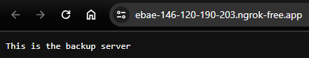

# Load Balancing

## Overview

This project sets up a load balancing solution using Nginx, designed to route traffic to different servers based on geographic location. It includes servers for the UK, the US, and a general server for the Rest of the World. The setup also utilizes Ngrok for tunneling the load balancer to the outside world, allowing for easy external access and testing.

---

## 1. Setup Explanation

### Load Balancer Configuration

- **Nginx Load Balancer**: The central component is an Nginx server configured to function as a load balancer.
- **Server Allocation**:
  - **UK Server**: Traffic from the UK is routed to this server.
  - **US Servers**: There are two servers for handling US traffic, providing redundancy and load distribution.
  - **Rest of the World Server**: This server handles traffic from all other regions.

### Failover Mechanism

- In the event of a failure in the primary servers, the load balancer is configured to redirect all traffic to a designated backup server. This ensures continuous availability of the service.

---

## 2. Ngrok Setup

### Purpose

- **External Access**: Ngrok is used to expose the local load balancer to the internet, facilitating testing and access from external sources.

### Configuration Steps

1. **Download and Install Ngrok**: Visit [Ngrok's website](https://ngrok.com/) and follow the instructions to download and install Ngrok on your system.
2. **Run Ngrok**: Expose the load balancer's port (usually 80) using Ngrok:
   ```bash
   ngrok http 80
   ```
   Or, replace `NGROK_AUTH_TOKEN` with your token to make use of ngrok service in Docker Compose.
3. **Public URL**: Ngrok provides a public URL that tunnels to your local load balancer. Use this URL for external access and testing.

---

## 3. Testing with Ngrok

### Test Scenarios

1. **Without VPN**: Access the Ngrok URL without a VPN to simulate non-UK/US traffic.
   - **Expected Result**: Traffic should be routed to the Rest of the World server.
   - **Result**: 

2. **Without VPN and Server Down Directive**: Temporarily disable the Rest of the World server in the load balancer configuration.
   - **Expected Result**: All traffic should be routed to the backup server.
   - **Result**: 

3. **With UK VPN**: Connect to a UK VPN and access the Ngrok URL.
   - **Expected Result**: Traffic should be routed to the UK server.
   - **Result**: , 

4. **With UK VPN and Server Down Directive**: Disable the UK server in the load balancer configuration.
   - **Expected Result**: Traffic from the UK VPN should be routed to the backup server.
   - **Result**: , 

### Notes for Testing

- Ensure that Ngrok is running during all test scenarios.
- Change the load balancer configuration to simulate server downtime.

---

## Conclusion

This project demonstrates a geographically aware load balancing solution using Nginx and Ngrok. The testing scenarios outlined above are crucial for validating the setup and ensuring that the traffic routing and failover mechanisms function as expected.
